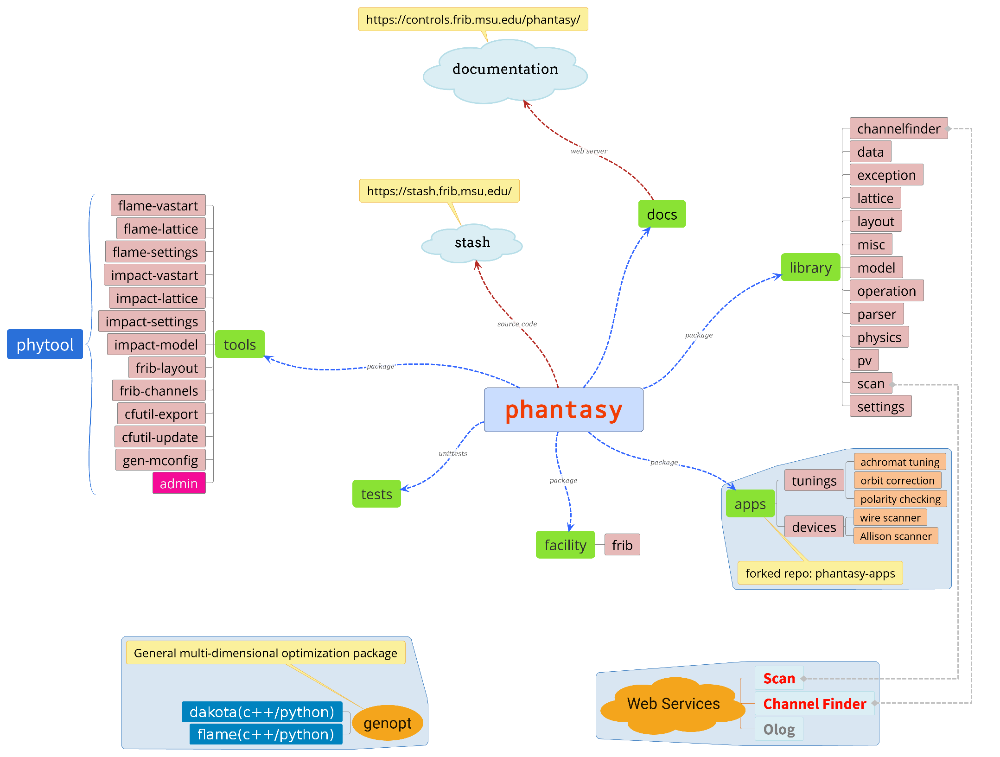

Introduction
============

About the name
--------------

.. only:: latex
    
    ``phantasy`` is brief for **P**\ hysics **H**\ igh-level
    **A**\ pplications a **n**\ d **T**\ oolkits for **A**\ ccelerator
    **Sy**\ stem.

.. only:: html

    .. raw:: html

        <tt>phantasy</tt> is brief for 
        Physics
        High-level 
        Applications
        and 
        Toolkits for 
        Accelerator
        System.

Framework
---------

