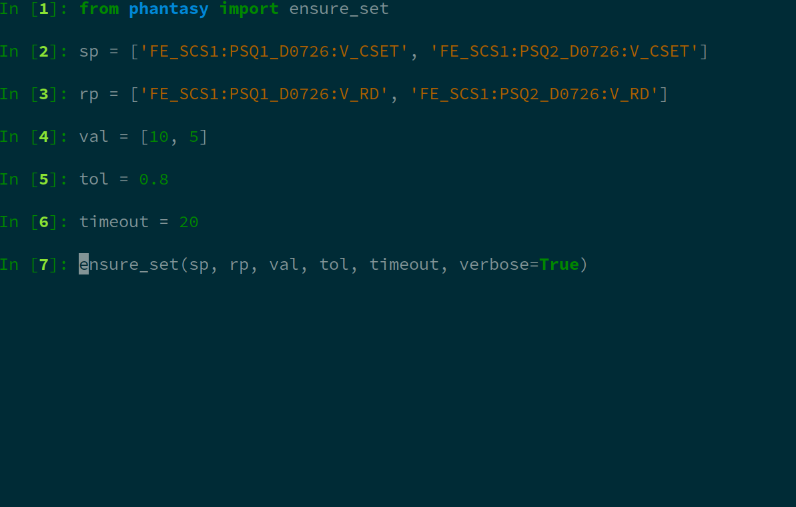

Control Device Setting with Ensure Set Function
===============================================

``ensure_set`` is developed with the goal of ensure the device readback
value reaches the set value, in the given amount of time. The discrepancy
between the readback and setpoint values is being monitored, and will be
marked "reached" when it falls into the range defined by the tolerance.

Two approaches are developed to support such operation:

- By using the Python function called ``ensure_set``, i.e. ``from phantasy import ensure_set``

.. image:: ../../images/tools/ensure_set_02.png
    :align: center
    :width: 600px

- By using the CLI tool called ``ensure_set``, just type in the Terminal.

.. image:: ../../images/tools/ensure_set_03.png
    :align: center
    :width: 600px

